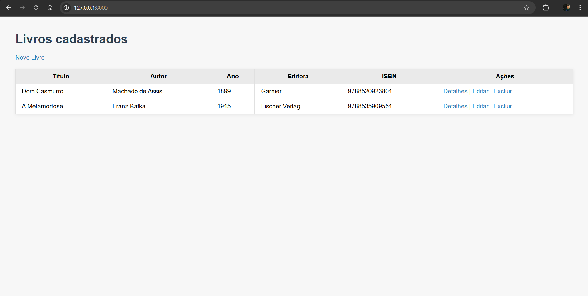
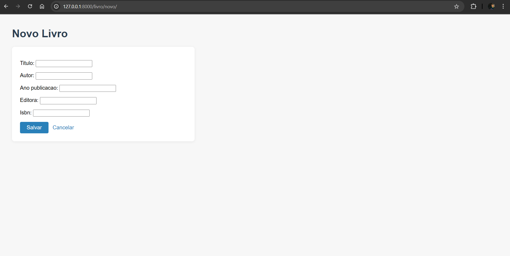
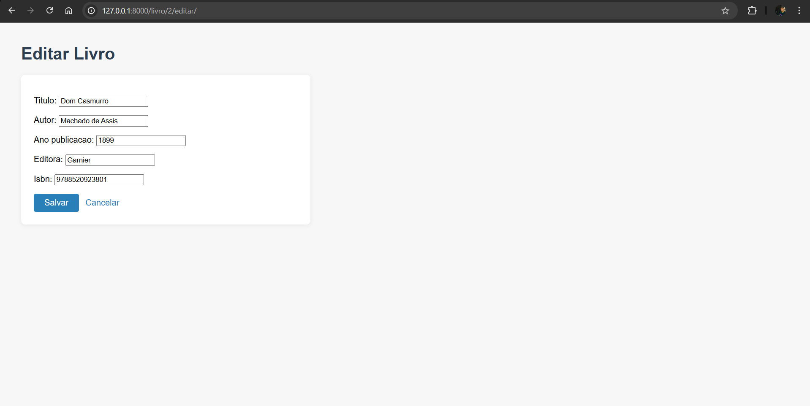
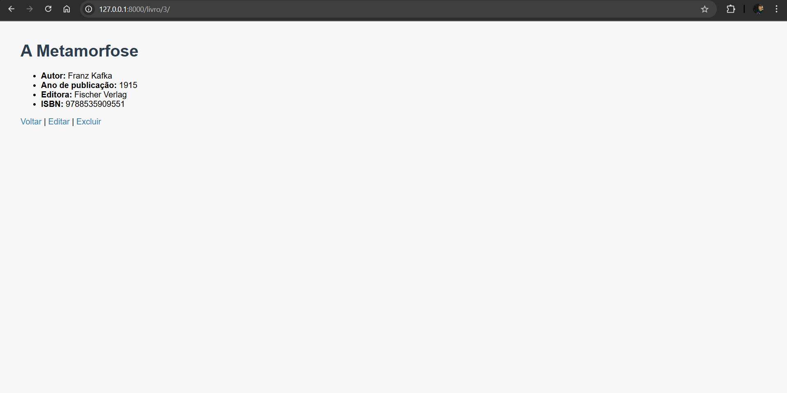

# Livraria Django

Sistema web simples para cadastro de livros, desenvolvido em Django, utilizando Class-Based Views (CBV).

## Funcionalidades
- Cadastro de livros com os campos: título, autor, ano de publicação, editora e ISBN.
- CRUD completo (criar, listar, detalhar, editar, excluir).
- Interface simples e responsiva.

## Rotas principais
| Rota                        | Descrição                        |
|-----------------------------|----------------------------------|
| `/`                         | Lista todos os livros            |
| `/livro/novo/`              | Cadastra um novo livro           |
| `/livro/<id>/`              | Detalha um livro                 |
| `/livro/<id>/editar/`       | Edita um livro                   |
| `/livro/<id>/excluir/`      | Exclui um livro                  |
| `/admin/`                   | Admin do Django                  |

## Prints das telas

Adicione abaixo prints das principais telas do sistema:


### 1. Tela de listagem de livros


### 2. Tela de cadastro de livro


### 3. Tela de edição de livro


### 4. Tela de detalhes do livro


## Como rodar o projeto
1. Instale as dependências:
   ```bash
   pip install -r requirements.txt
   ```
2. Realize as migrações:
   ```bash
   python manage.py migrate
   ```
3. Inicie o servidor:
   ```bash
   python manage.py runserver
   ```
4. Acesse em [http://127.0.0.1:8000/](http://127.0.0.1:8000/)


